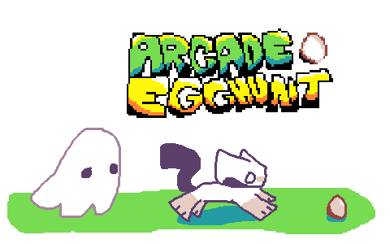

# 
## Story:
You are you (fast and hungry)

You love eggs (they probably love you too)

Ghosts hate you (stun you and want to kill you)

Eggs heal you from otherworldly injuries (while not stunned, of course)

Eat the most eggs before time runs out (2 minutes)

Don't die (It's stupid)
## Controls:
W, A, S, and D (or arrow keys) = Move

Z, ENTER, or SPACE = A Button

X, SHIFT, or ESCAPE = B Button

This game has controller support too (for some reason)
## Fun Fact:

It originally was a MakeCode Arcade game, which you can [play here](https://arcade.makecode.com/S67393-02204-15797-46303)!